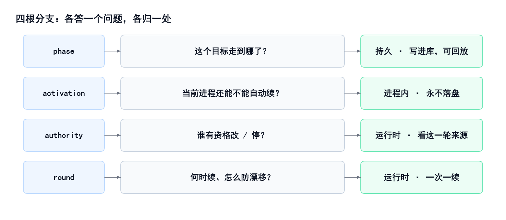

# 给 Agent 加长期目标：进展可以记住，开机不准自己跑

**TL;DR**

- 长跑目标是探针，不是功能开关。它压的是 Agent Harness 的生命周期、权限和验收，不是模型记不记得继续。
- 别把长期目标焊进主循环。发动机不动，旁边一本可以回放的账。
- 状态可回放，权限必须重授。进展能记住；自动续跑必须重新授权。
- 「我做完了」不算完。听工作区。卡住要连续出现，才允许认输。
- 能抄走的是这套切割，不是某个仓库里的文件名。

给 Agent 加「长期目标」，第一反应通常是三件事：改主循环、加一个计数器、在提示词里写「请继续完成目标」。

这三条都快，也都会在同一处裂开。重启之后不知道当时叮嘱了什么；恢复出来的会话自己跑起来；模型把目标偷偷改小，好早点收工。

Kilo Code（opencode 的开源分支）落地这套能力时，参考了 DeepSeek Harness 的目标子系统。贯穿始终的一句判断是：

**状态可以回放，权限必须重授。**

人话就是：作业做到哪一页，可以写在本子上；但不能因为夹着书签，电脑一开机就自己写下去。

为什么要做这件事？不是给产品加一个「目标」开关，也不是比谁的模型更听话。换模型解决不了「人走开之后还盯不盯得住原题」。那是 Harness 的活。长跑目标是一根探针，压的是三件事：

1. **生命周期**：跨回合盯住同一个目标，账要能回放，空闲才续一轮。
2. **权限治理**：开机不准自己跑；改题、停题看这一轮是谁签发的。
3. **结果验收**：「我做完了」不算完，听工作区；卡住要连续出现才允许认输。

模型决定智商上限。Harness 决定人走开之后还能不能可靠地干活。压得住这三件事，才算有一套 Agent Harness，而不是一套会喊「请继续」的提示词套壳。

下面按这个顺序讲。每一步先说它是什么，再说它不是什么。

---

## 第一反应是错路

别把长期目标焊进发动机。发动机还是原来的发动机；目标是旁边一本可以回放的账。

是：主循环一行不改，一个服务专门记目标。人的命令、模型的工具、空闲时的调度，都只消费这个服务，谁也不私藏一份。

不是：在 loop 里加 goal 分支，也不是靠提示词让模型「记得继续」。

---

## 脉络：加一个目标，不要改 loop

判断按这条链往下走。上一步如果走了「不是什么」，后面的实现再漂亮也会裂。

| 步 | 是什么 | 不是什么 |
|---|---|---|
| 需求 | 盯住一个目标，跨回合直到真正完成 | 改 loop、加计数器、把「请继续」写进提示词 |
| 接缝 | 一个服务持有状态；命令 / 工具 / 调度只消费 | 单体功能；消费者各存一份 |
| 树根 | 一个会话一行表，读这一行就是现在 | 事件流折账；只活在内存的叮嘱 |
| 主干 | 核对版本：现在是第几版、走到哪 | 谁后写谁赢；满地布尔开关 |
| 切开 | 「走到哪」可以持久；「这一进程还准不准自动续」只活在当前进程 | 把「能否自动续跑」写进库，让恢复或 fork 自己跑起来 |

Kilo 的会话日志不是产品日志，所以树根没有走「每次变更追加一条、再把流水账折一遍」。它选了一张表、一行。这不影响主线：账必须能回放，授权必须当场重授。

---

## 树：每层回答一个问题

目标功能不是一个开关。它是从这本账上长出来的一棵树。红字是「不是什么」。树叶只实现所属那根枝，不另开主干。

判断一套目标功能靠不靠谱，先看根和主干，不要先看它有多少工具、多少命令。叶子会改名、搬家、重写；根和主干对了，换一套实现还是同一棵树。

---

## 接缝：一个服务，三个消费者

人改目标、模型改目标，都进同一个服务。服务去改那一行。空闲调度看到变更，才决定要不要开下一轮。

是：状态只在一处。不是：命令、工具、调度各存一份，对不上再猜。

---

## 树根：一行表当真相，不是两套账

Codex 那条路：每个线程一行表，读这一行就知道现在的目标。重启后如果还是进行中，就重新武装。

DeepSeek Harness 那条路：不另开抽屉。每次变更往会话日志追加一条，把流水账折一遍，得到现在。重启强制解除武装——账可以回放，自动续跑的授权必须人再给一次。

Kilo 走的是杂交。会话日志撑不起产品真相，所以记账学 Codex：一张表，一个会话一行。但开机后的权限学另一边：进程一启动，武装标志是空的。表上可以仍是「进行中」，这一进程却不准自动续。

产品契约可以相近：空闲续跑、防漂移、拿证据再完成。记账法和「重启后能不能自己跑起来」，可以完全不同。选你的系统已经认哪本账。两边都做，就是两套真相。

人话：抽屉里放一张卡片，卡片上写着现在的答案。电脑重启后，卡片还在；但「准你接着写」这支笔，必须人再递一次。

---

## 主干：同时改一份账，过期的丢掉

像两个人同时改同一份文档。后保存的那份不该默默覆盖先保存的那份。

改之前记下「我看到的是第 3 版」。提交时如果已经是第 4 版，这份改动作废，重新读再改。这就是比较并设置：先核对还是这一版，对得上才收下，版本号加一。

是：先读到第几版，改的时候核对还是这一版。

不是：谁后写谁赢，也不是加一把大锁让全世界排队。模型被要求：先读，再把读到的编号和版本原样抄回去。后写覆盖在这里是 bug，不是策略。

---

## 切开：走到哪可以记住，准不准自动续必须重授

「走到哪」写成进行中 / 已暂停 / 被挡住 / 已完成，写进那一行，可以回放。

「这一进程还准不准自动续」写成已武装 / 已解除，只存在于当前进程。启动、恢复、fork，一律先解除武装。

所以会出现这种合法组合：账上还是「进行中」，这一进程却不准自动续。它不会自己跑起来。必须等人明确说继续，才会重新武装。

这就是「状态可回放，权限必须重授」的字面意思。

---

## 谁能改：看这一回合还活着，不看提示词，不看血缘

改目标、停目标，不靠「请你不要乱改」，也不靠「你是从哪个会话分出来的」。

Kilo 看的是这一回合还活着的来源。最后一轮用户消息里，有没有一段不是系统代写的人话——有，才允许创建、改题、暂停、继续。报完成、报卡住，额外接受当前这一轮自动续跑那条窄通道：只能报告终止，不能改题目。

子代理、插件塞进来的话、已经结束的回合，过不去。

血缘能说明来历，不能代替这一回合的签发。提示词只能引导「该不该」；执行期校验才决定「能不能」。

---

## 续跑：空了才续一次；题目每一轮重新念一遍

四个条件同时成立，才开下一轮：闲着、还在进行中、这一进程已武装、轮次还没用完。每次空闲最多续一次。不是重试队列，不是定时器，不是循环计数器。

长期目标最常见的死法，不是跑不动，是模型偷偷改题。所以每一轮把完整目标再注入一次。收工不听口头，听工作区。卡住也要同一条件连续出现，才允许认输——避免一轮运气不好就放弃。

失败即停。写账失败、排队失败、调度异常，都解除武装或标成卡住，不乐观重试。

四根枝各答一个问题，各归一处，不互相借用：

---

## 收获和结论

长跑压的是 Harness 三件事：生命周期、权限、验收。树叶会改名，函数会搬家。能抄走的是下面七句。

**收获**

1. **别把目标焊进主循环。** 发动机不动；旁边一本可以回放的账。不是在 loop 里加分支。
2. **状态可回放，权限必须重授。** 进展写进表；自动续跑授权只活在这一进程。不是恢复后自己接着跑。
3. **模型看见的，必须能从账上翻出来。** 内存叮嘱、口头「请继续」，不算目标功能。
4. **同时改一份账，过期的丢掉。** 先读版本再改。谁后写谁赢是 bug。
5. **「我做完了」不算完。** 听工作区。卡住要连续出现，才允许认输。
6. **记账法可以不同，权限那一刀可以单独选。** 一行表或一串事件，二选一。Kilo 选了一行表，但开机仍要人点继续。
7. **树根和主干错了，叶子再漂亮也会在同一处裂开。** 改 loop、把武装写进库、用提示词当权限——恢复、fork、子代理、空闲续跑会一起爆。

**结论**

给 Agent 加长期目标，不是让它「记得继续」，而是拿长跑当探针，验证 Agent Harness 能不能管住三件事：生命周期、权限、验收。世界要有一本可回放的账，每一次真正跑起来都重新拿到执行授权，收工听工作区不听口头。Kilo 证明了：你可以选 Codex 那种一行表，同时保住「开机不准自己跑」。能抄走的是这套切割，不是某个仓库里的文件名。

**PS.** 如果你只带走一句：状态可回放，权限必须重授。恢复出来的会话可以记得作业做到哪一页，但不能因为夹着书签，电脑一开机就自己写下去。

**PPS.** 这和「把模型训得更听话」不是一回事。长跑压的是 Harness，不是记性。提示词只能引导该不该；执行期校验才决定能不能。血缘、分叉、子代理，都代替不了这一回合的签发。

**PPPS.** 文里的表名、工具名都会过时。如果你在自己的系统里只改 loop、把「准不准续跑」写进库、用提示词当权限——恢复、分叉、空闲续跑，会在同一处裂开。那才是这篇要拦的事：Harness 还没立住。
