# 给 Agent 加长期目标：进度能留下，重启后别自己接着干

**TL;DR**

- 这篇不是再做一个待办。它用长期目标当探针，压一遍 Agent Harness：新能力能不能接上、不拆发动机。
- 进展写进账，可以回放；自动续跑的资格只活在当前进程，重启后必须人再给一次。
- 一个服务持有状态。命令、工具、调度只消费，谁也不另存一份。
- 完成听工作区。卡住要同一条件连续出现，才允许认输。
- 能抄走的是切割：记账法可以学 Codex，权限那一刀可以学另一边。

---

## 为什么这么做

这篇不是再做一个待办列表。Kilo Code 落地长期目标时，对照了 DeepSeek Harness 的目标子系统，也对照了 Codex 那张「每线程一行」的表。要验证的是：新能力能不能接到已经写明的接缝上，发动机一行不动。

接得上，Harness 才是运行时。接不上，它只是套了工具的聊天循环。换一个更听话的模型，也过不了这关。

贯穿实现的一句判断，只在这里定义一次：

**状态可以回放，权限必须重授。**

作业做到哪一页，可以写在本子上。夹着书签，电脑一开机却不准自己写下去。这不是文风。这是在问一套运行时到底能不能当 Harness 用。

长期目标正好踩到六件最容易骗人的事：

1. **新能力走接缝。** 一个服务记状态，命令 / 工具 / 调度只消费。接不进循环外面，说明「不改 loop」只是口号。
2. **模型看见的，必须能从账上翻出来。** Kilo 的会话日志不是产品日志，账是一张表、一个会话一行。只活在内存里，恢复和拷会话会对不齐。
3. **持久事实 ≠ 执行授权。** 账可以回放；重启后别自己接着干。授权跟着账走，恢复就会偷跑。
4. **空闲了再开一轮，不伸进循环内脏。** 调度看到变更才续。伸进 loop 内部，接缝就不是接缝。
5. **权限看这一回合还活着。** 提示词、血缘、拷出来的会话，都不能签发。只靠「请你别乱改」，子代理会改题。
6. **失败即停。** 过期写入丢掉。乐观重试会把账写花。

过了这六关，Harness 才是运行时。Goal 不是再做一个待办。它是在问：长期目标能不能接上，而不拆开发动机。

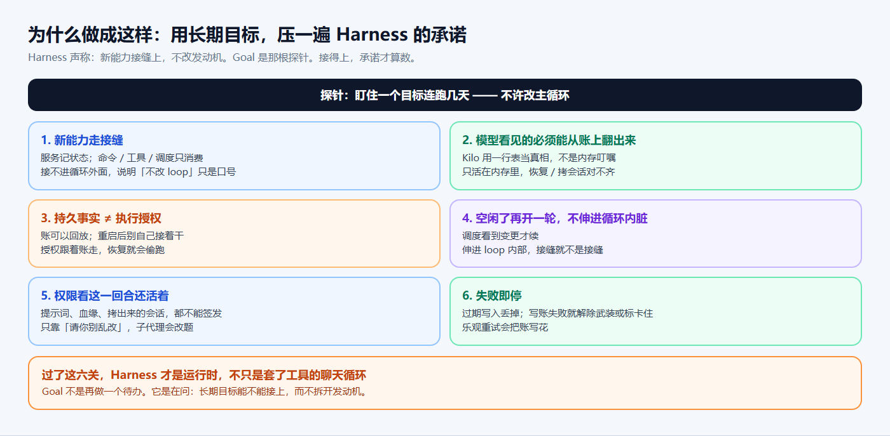

---

## 第一反应会改主循环

想让 Agent 盯着一个目标连跑几天，常见做法是改主循环、加轮次计数器、在系统提示词里写「请继续完成目标」。三条都会在同一处裂开：重启后说不清当时叮嘱了什么，恢复出来的会话自己跑起来，模型把目标改小好早点收工。

主循环继续当发动机。目标放在旁边一本可以回放的账里。

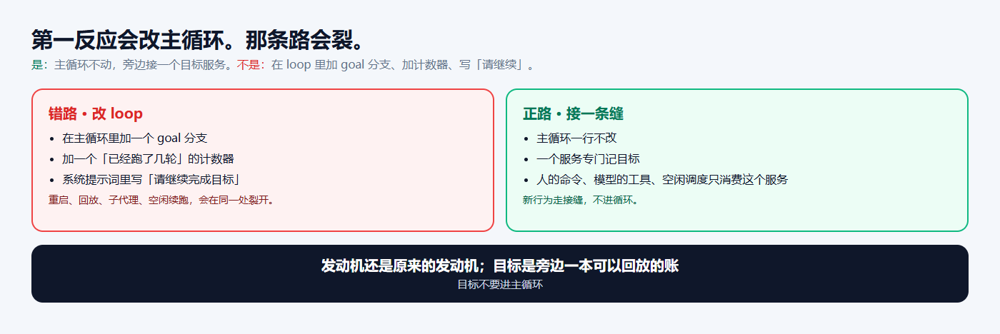

是：主循环一行不改，一个服务专门记目标。人的命令、模型的工具、空闲时的调度，都只消费这个服务。

不是：在 loop 里加 goal 分支，靠提示词让模型「记得继续」。

---

## 脉络：需求到切开

上一步走错，后面的实现再漂亮也会裂。

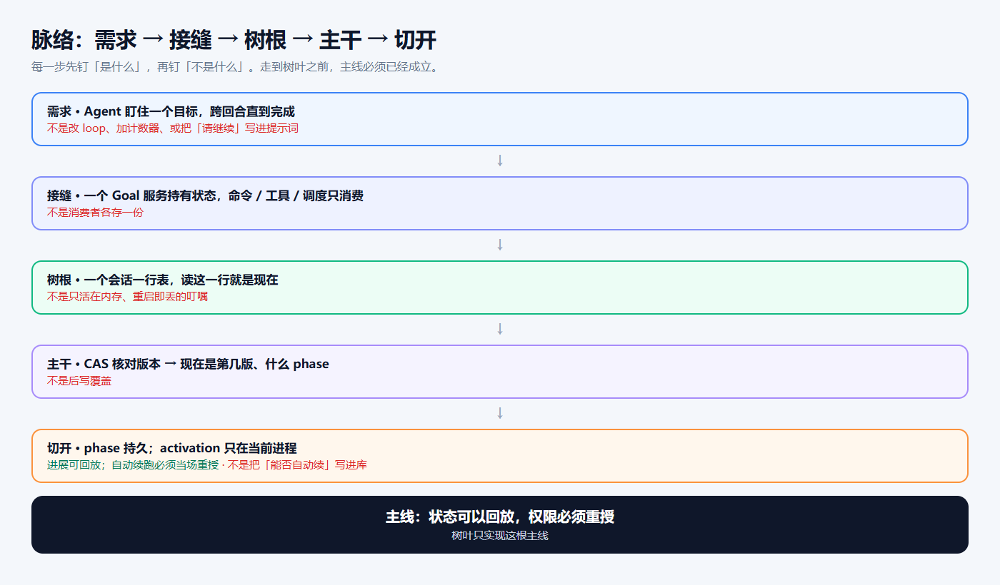

| 步 | 是什么 | 不是什么 |
|---|---|---|
| 需求 | 盯住一个目标，跨回合直到完成 | 改 loop、加计数器、把「请继续」写进提示词 |
| 接缝 | 一个服务持有状态；命令 / 工具 / 调度只消费 | 消费者各存一份 |
| 树根 | 一个会话一行表，读这一行就是现在 | 只活在内存的叮嘱 |
| 主干 | 核对版本：现在是第几版、走到哪 | 谁后写谁赢 |
| 切开 | 进展可持久；「这一进程还准不准自动续」只活在当前进程 | 把「能否自动续」写进库，恢复或 fork 自己跑起来 |

Kilo 的会话日志撑不起产品真相，树根没有走「每次变更追加一条、再把流水账折一遍」。它选了一张表、一行。账必须能回放，授权必须当场重授。这条主线不受记账法影响。

---

## 树：每层回答一个问题

目标功能从这本账上长出来。每层只答一个问题。树叶只实现所属那根枝。

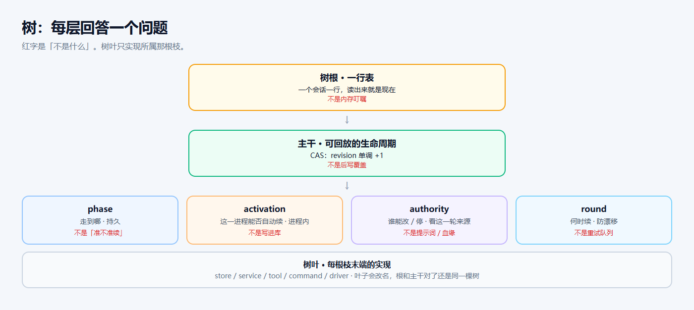

判断一套目标功能，先看根和主干，不要先数工具和命令。叶子会改名、搬家。根和主干对了，换一套实现还是同一棵树。

---

## 接缝：一个服务，三个消费者

人改目标、模型改目标，都进同一个服务。服务去改那一行。空闲调度看到变更，才决定要不要开下一轮。

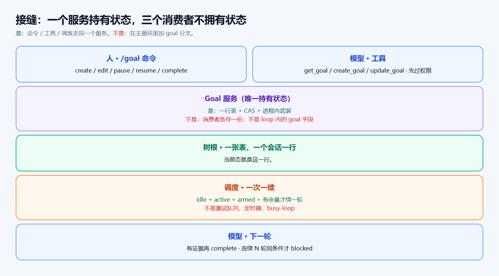

是：状态只在一处。

不是：命令、工具、调度各存一份，对不上再猜。

---

## 树根：一行表当真相

Codex：每个线程一行表，读这一行就知道现在的目标。重启后如果还是进行中，就重新武装。

DeepSeek Harness：每次变更往会话日志追加一条，把流水账折一遍得到现在。重启强制解除武装。账可以回放，自动续跑的授权必须人再给一次。

Kilo 走杂交。会话日志不是产品日志，记账学 Codex：一张表，一个会话一行。开机后的权限学另一边：进程一启动，武装集合是空的。表上可以仍是「进行中」，这一进程却不准自动续。

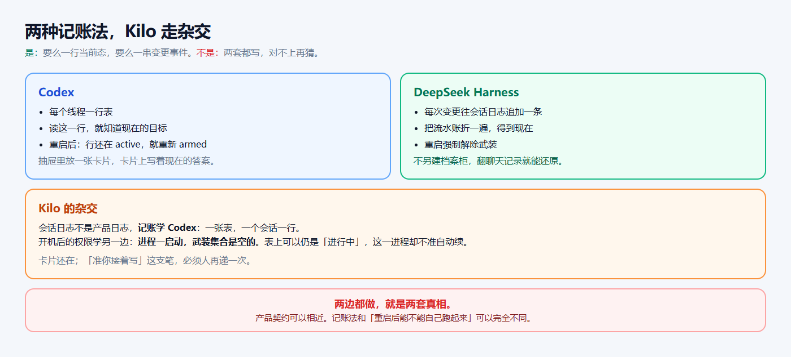

产品契约可以相近：空闲续跑、防漂移、拿证据再完成。记账法和「重启后能不能自己跑起来」可以完全不同。选你的系统已经认哪本账。两边都做，就是两套真相。

抽屉里放一张卡片，卡片上写着现在的答案。电脑重启后卡片还在。「准你接着写」这支笔，必须人再递一次。

---

## 主干：同时改一份账，过期的丢掉

两个人同时改同一份文档。后保存的那份不该默默覆盖先保存的那份。

改之前记下「我看到的是第 3 版」。提交时如果已经是第 4 版，这份改动作废，重新读再改。比较并设置（CAS）：先核对还是这一版，对得上才收下，版本号加一。

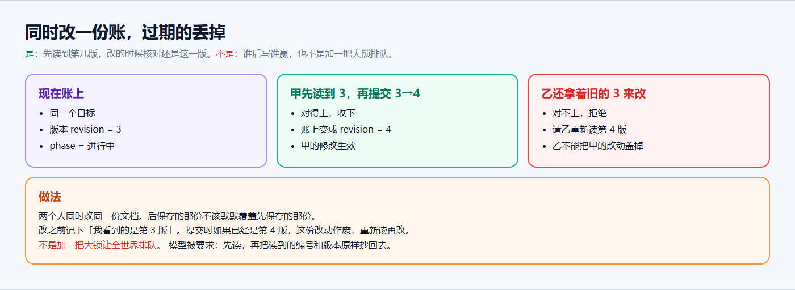

是：先读到第几版，改的时候核对还是这一版。

不是：谁后写谁赢，也不是加一把大锁让全世界排队。模型被要求先读，再把读到的编号和版本原样抄回去。后写覆盖在这里是 bug。

---

## 切开：走到哪可以记住，准不准自动续必须重授

「走到哪」写成进行中 / 已暂停 / 被挡住 / 已完成，写进那一行，可以回放。

「这一进程还准不准自动续」写成已武装 / 已解除，只存在于当前进程。启动、恢复、fork，一律先解除武装。

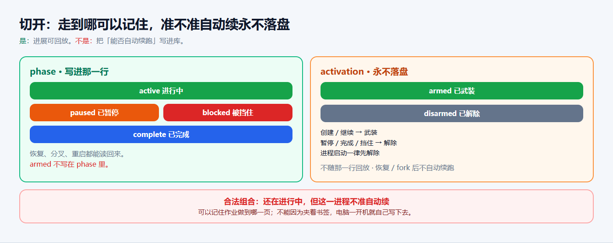

合法组合：账上还是「进行中」，这一进程却不准自动续。它不会自己跑起来。必须等人明确说继续，才会重新武装。

这就是前面那句判断的字面意思。

---

## 谁能改：看这一回合的来源

改目标、停目标，不靠「请你不要乱改」，也不靠「你是从哪个会话分出来的」。

Kilo 看最后一轮用户消息里有没有一段不是系统代写的人话。有，才允许创建、改题、暂停、继续。报完成、报卡住，额外接受当前这一轮自动续跑：只能报告终止，不能改题目。

子代理、插件塞进来的话、已经结束的回合，过不去。

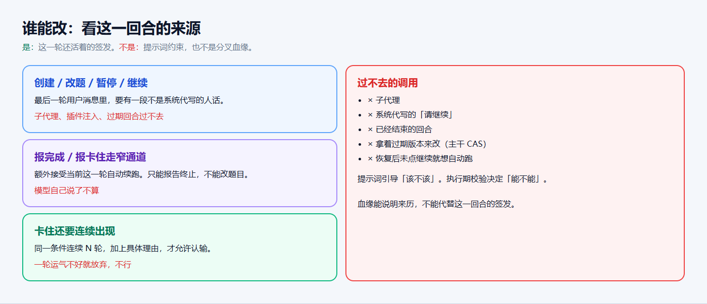

血缘能说明来历，不能代替这一回合的签发。提示词引导「该不该」。执行期校验决定「能不能」。

---

## 续跑：空了才续一次

四个条件同时成立才开下一轮：闲着、还在进行中、这一进程已武装、轮次还没用完。每次空闲最多续一次。

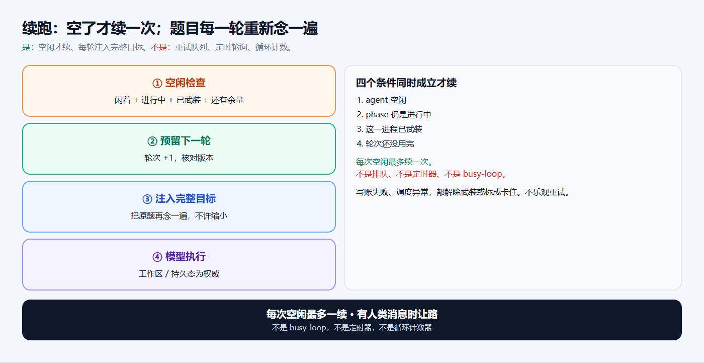

长期目标常见的死法是模型偷偷改题。每一轮把完整目标再注入一次。收工听工作区。卡住要同一条件连续出现，才允许认输，避免一轮运气不好就放弃。

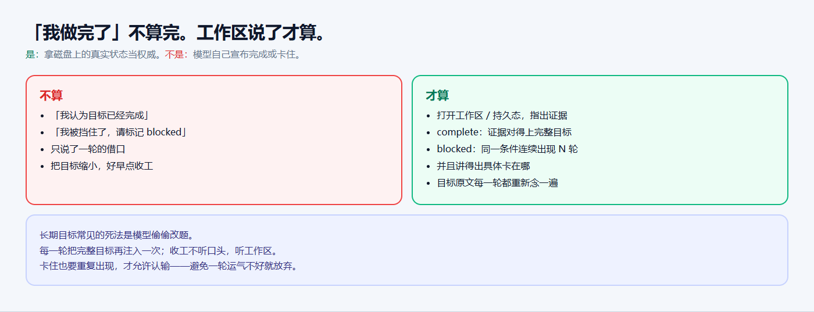

写账失败、排队失败、调度异常，都解除武装或标成卡住。不乐观重试。

---

## 收获和结论

树叶会改名。能抄走的是下面七句。

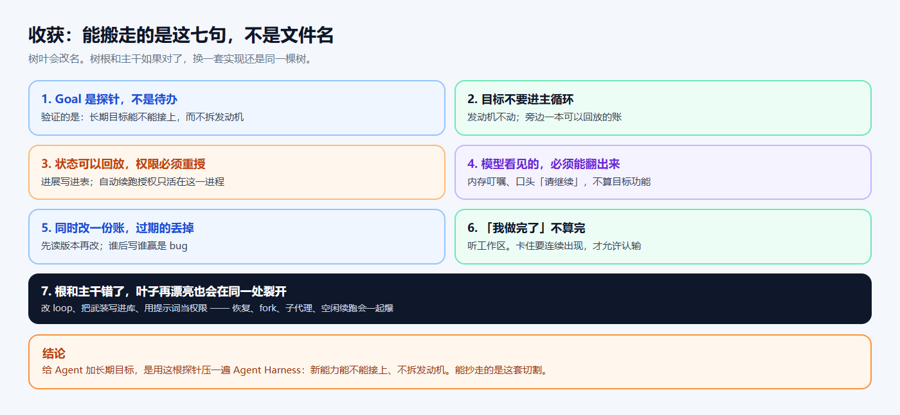

**收获**

1. **Goal 是探针，不是待办。** 验证的是：长期目标能不能接上，而不拆发动机。
2. **目标不要进主循环。** 发动机不动；旁边一本可以回放的账。接不进循环外面，「不改 loop」只是口号。
3. **状态可以回放，权限必须重授。** 进展写进表；自动续跑授权只活在这一进程。不是恢复后自己接着跑。
4. **模型看见的，必须能从账上翻出来。** 内存叮嘱、口头「请继续」，不算目标功能。
5. **同时改一份账，过期的丢掉。** 先读版本再改。谁后写谁赢是 bug。
6. **「我做完了」不算完。** 听工作区。卡住要连续出现，才允许认输。
7. **根和主干错了，叶子再漂亮也会在同一处裂开。** 改 loop、把武装写进库、用提示词当权限——恢复、fork、子代理、空闲续跑会一起爆。

**结论**

给 Agent 加长期目标，不是让它「记得继续」，也不是再做一个待办。是用这根探针压一遍 Agent Harness：新能力能不能接上、不拆发动机。过了这关，它才是运行时；过不去，它只是套了工具的聊天循环。Kilo 选了 Codex 那种一行表，重启后仍然要人点继续。能抄走的是这套切割。

**PS.** 只带走一句就带走定义那句。恢复出来的会话可以记得作业做到哪一页，不能因为夹着书签，电脑一开机就自己写下去。

**PPS.** 这和把模型训得更听话无关，也和待办列表无关。提示词管该不该；校验管能不能；Harness 管接不接得上。

**PPPS.** 表名、工具名都会过时。只改 loop、把「准不准续跑」写进库、用提示词当权限，恢复、分叉、空闲续跑会在同一处裂开。那说明 Harness 还没做成。
