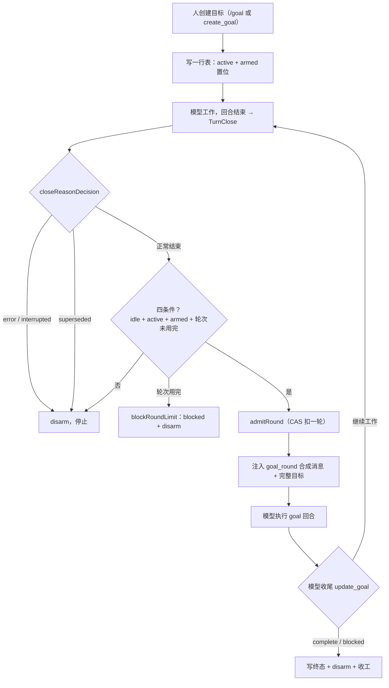

# Kilo 修改面经：给 Agent 加持久化长期目标

## 0. 一句话定位（电梯陈述）

**Kilo Code 是 OpenCode 的 fork，一个 AI coding agent 运行时（CLI 核心 + VS Code / JetBrains 客户端）。我们最近的核心修改是给 Agent 加"持久化长期目标"：让一个 agent 跨多个回合持续盯一个目标直到真正完成，但重启后不能自己偷跑。** 技术上的一句话是"状态可以回放，权限必须重授"，做法上是"不改主循环，靠接缝接入"。

---

## 1. 改了什么（范围，先给数字）

首版 `c9b1ae6` 新增约 1243 行，全部落在 Kilo 自有目录 + 3 处接缝：

| 位置 | 内容 |
|---|---|
| `packages/opencode/src/kilocode/goal/`（12 文件） | 全功能：store / service / driver / tool / prompt / command / config / types / authority / admission / runtime |
| `kilocode/agent/index.ts:650-670` | 注册 `goal` 主 agent（kilocode_change 标记） |
| `kilocode/tool/registry.ts` | 注册 `get_goal` / `create_goal` / `update_goal` 三个工具 |
| `src/command/index.ts:121` | 注册 `/goal` 命令 |
| `kilocode/bootstrap.ts:60-67` | 订阅 `TurnClose` 事件，触发空闲续跑 |
| `test/kilocode/goal.test.ts` | 296 行、16 个用例 |
| `docs/zhihu-goal/` | 设计文章 + 12 张图 + 发布说明 |

**关键结论：改共享上游文件只用了 3 个单行 `kilocode_change` 标记 + 1 个订阅块，其余逻辑全在 `kilocode/` 目录里。** 这是能扛住"你们怎么处理 fork 合并冲突"这个必考题的事实基础。

---

## 2. 核心设计思想（面试官问"为什么"最多的地方）

### 2.1 为什么不做进主循环

常见三种做法都会在同一个地方裂开：改主循环加 goal 分支、加轮次计数器、在系统提示词写"请继续完成目标"。

**裂的原因**：重启后说不清当时叮嘱了什么；恢复出来的会话自己跑起来；模型把目标改小好早点收工。

正解：**主循环一行不动，旁边放一本可以回放的账（goal 服务）。命令、工具、调度都只消费这个服务，谁也不另存一份状态。**

### 2.2 一句话判断（全文只定义一次）

> **状态可以回放，权限必须重授。**

- 进展（active / paused / blocked / complete + 目标文本）写进数据库表 → 可回放。
- 自动续跑的"武装"标志只活在当前进程内存，启动 / 恢复 / fork 一律解除武装 → 重启后必须人再点一次"继续"。

### 2.3 记账法选型：Codex vs DeepSeek Harness，Kilo 杂交

- **Codex**：每个线程一行表，读这一行就是现在，重启后若仍进行中就重新武装。
- **DeepSeek Harness**：每次变更追加一条事件，把流水账折一遍得到现在，重启强制解除武装。
- **Kilo**：会话日志不是产品日志，撑不起真相，所以记账学 Codex（一张表、一行）；开机权限学 Harness（进程一启动武装集合为空）。

**记账法（一行表 vs 事件流）和"重启后能不能自己跑"是两个正交问题，别混为一谈。** 两边都做就是两套真相。

---

## 3. 分层拆解：树根 → 主干 → 四根枝

下面这张执行图串起一次目标从创建到收工的完整链路。重点看三个闸门（closeReasonDecision、四条件、模型收尾）和两个标志：phase 落盘、armed 只在进程内。



这张图的关键：主循环（TurnClose → 模型执行）本身一行没改，driver 是挂在 TurnClose 事件上的旁路；每次空闲最多续一轮，续出来的新回合结束又会触发 TurnClose，形成"一次一续"的循环，直到终态或失败才 disarm。

### 树根：一行表（`store.ts`）

`kilo_goal` 表，`session_id` 主键，一个会话一行。字段：id、revision、objective、phase、blocked_reason、max_rounds、rounds_started、created_at、updated_at。

**表懒创建（`store.ts:39-52` 的 `CREATE TABLE IF NOT EXISTS`），不碰上游 migration**——这是"新能力接上、发动机不动"在存储层的体现。

### 主干：CAS 并发（`store.ts:216-261` mutate）

改之前读版本号，提交时核对还是不是这一版，对得上才写、版本号 +1：

```ts
// store.ts 的 mutate 核心：先核对再写，写后再验证
if (current.id !== expected.id || current.revision !== expected.revision) {
  throw new Error(`stale goal ref; current revision is ${current.revision}`)
}
// ...
UPDATE kilo_goal SET ... WHERE session_id = ${sessionID} AND id = ${expected.id} AND revision = ${expected.revision}
// 再 SELECT 验证写入成功，失败抛 "update did not apply"
```

是"先读再核对"，不是"谁后写谁赢"，也不是加全局大锁让全世界排队。

### 枝一：生命周期 phase（可回放的一半）

`types.ts:16` 四个状态 `active | paused | blocked | complete`。转移矩阵在 `store.ts:181-186`：

```ts
const allowed: Record<GoalPhase, readonly GoalPhase[]> = {
  active: ["paused", "blocked", "complete"],
  paused: ["active", "complete"],
  blocked: ["active", "complete"],
  complete: [],  // 终点
}
```

### 枝二：armed 激活（必须重授的一半）

`service.ts:10` `const armed = new Set<string>()` —— 进程内集合，不落盘，进程启动为空。arm/resume 加进去，pause/complete/block/disarm 删掉（`service.ts:27-37`）。

**合法组合：表上还是"进行中"，这一进程却不准自动续。** 这就是"状态可回放、权限必须重授"的字面实现。

### 枝三：权限 authority（`authority.ts` + `tool.ts`）

不看血缘（从哪个会话 fork 出来的）、不看提示词（"请你别乱改"），只看**最后一轮用户消息里有没有非 synthetic 的文本 part**：

- `authority.ts:18-21` `directHuman`：最后一个 user 消息存在 `type==="text" && !synthetic` 的 part。
- `authority.ts:24-34` `isGoalRound`：`synthetic===true` 且文本含 `<goal_round>`。

**关键点**：人在对话里手打 `<goal_round>` 不算——synthetic 标志只有 harness 注入时才是 true，人写的永远是 false。这是防"子代理 / 插件塞进来的话 / 已结束回合改题"的硬校验。

规则（`tool.ts:130-171`）：edit / pause / resume 必须 directHuman；complete / blocked 额外接受当前 goal round（自动续跑时允许报完成 / 报卡住，但不能改题）；blocked 还要过 round floor。

### 枝四：空闲续跑 driver（`driver.ts` + `admission.ts` + `bootstrap.ts`）

触发链：`bootstrap.ts:60-67` 订阅 `KiloSession.Event.TurnClose` → `driveGoal(sessionID, reason)`。

四个条件同时成立才开下一轮（`admission.ts:22-33` `evaluateDrive`）：**idle + active + armed + 轮次未用完**。每次空闲最多续一次。

续跑时注入的是**合成用户消息**（`synthetic:true`、含 `<goal_round>`），完整目标重新注入一次，走正常 session loop——这就是"不伸进循环内脏，靠接缝"的落地。

### 防漂移（`prompt.ts`）

每一轮重新注入完整 objective，不靠模型记忆。`prompt.ts:7-22` 的 `goalRoundPrompt` 把工作区 / tool 结果 / 持久状态当权威，"别信早前的叙述"。

### 证据先行完成（`agent.txt`）

`agent.txt:7-14`：claim complete 前收集证据（文件、commit、通过的检查），先 `get_goal` 拿准 id+revision 再 update。"我做完了"不算完。

---

## 4. 踩过的坑（两个 fix commit，面试最加分）

### 坑一：只跑一轮就停（`405bc1e`）

- **现象**：空闲自启动跑完第一轮就不续了。
- **根因**：goal 回合的 `TurnClose` 事件在 `prompt()` 还没 await 返回时就触发了（`driver.ts` 里 prompt 仍在执行），此时重入锁还在 driving 状态，第二个 TurnClose 被直接丢。
- **修复**：锁记录一个 pending slot，finally 里 pending 非空就再 drive 一次（`admission.ts:40-65` `createDriveLock`）。

**一句话答法**：TurnClose 和 prompt() 返回之间有竞态，用"一个 pending 槽"接住下一个 idle，不让它丢。

### 坑二：环境变量被 parseInt 截断（`21c14ed`）

- **现象**：`KILO_GOAL_MAX_ROUNDS=1.5` 或 `12abc` 被 `parseInt` 截成 1 或 12，悄悄生效。
- **修复**：先正则 `/^[1-9]\d*$/` 校验是纯正整数，再 `Number()` + `Number.isSafeInteger` 校验（`config.ts:5-15`）。

同一轮还修了：伪造 `<goal_round>` tag 的权限漏洞、maxRounds 低于已启动轮数的校验、嵌套 try/catch 改 then/fail。

---

## 5. 测试策略

**纯函数抽出来测，不 mock 模型**：

- `prompt` / `types` / `config` / `admission` / `authority`：全是纯函数，离线证明。
- `service`：打真实 store（SQLite），验证 create arms / complete disarms / stale revision 拒绝 / resume 清 block reason / complete 终态 / create after complete 换新 id。

**核心技巧**：`admission.ts` 和 `authority.ts` 被刻意抽成不含 `SessionPrompt`、不含数据库的纯模块（文件头注释明说），所以 idle 协议和权限协议不需要起模型就能用单测证明。这是"怎么测长期运行的 agent 逻辑"的好答案。

---

## 6. 高频面试题 + 参考答法

**Q1：为什么不能把目标做进主循环？**
答：三种常见做法（改 loop、加计数器、提示词"请继续"）都会在"重启"这一处同时裂开——说不清叮嘱了什么、恢复的会话自己跑、模型改小目标。目标是旁边一本可回放的账，主循环继续当发动机。

**Q2：状态和授权为什么要分开存？**
答：进展可以回放，但"这一进程还准不准自动续"必须当场重授。授权跟着账走，恢复 / fork 就会偷跑。所以 phase 落盘，armed 只活在进程内存。

**Q3：并发改同一个目标怎么处理？**
答：CAS。先读 revision，提交时核对 id + revision，对得上才写、revision+1，写后再 SELECT 验证。谁后写谁赢是 bug。

**Q4：模型说"我做完了"为什么不算？**
答：收工听工作区。claim complete 前必须收集证据（文件、commit、通过的检查），先 get_goal 拿准 id+revision。卡住要满足 round floor（至少启动 N 轮），避免一轮运气不好就放弃。

**Q5：怎么保证自动续跑不会无限跑？**
答：四条件（idle + active + armed + 轮次未用完）+ maxRounds 预算 + 每轮 CAS 扣一轮 + 失败即停（error/interrupted 直接 disarm，不乐观重试）。

**Q6：子代理能不能偷偷改目标？**
答：不能。权限不看血缘、不看提示词，只看最后一轮用户消息里有没有非 synthetic 的文本 part。子代理、插件注入、已结束回合都过不去。

**Q7：你们怎么处理 fork 的合并冲突？**
答：逻辑全放 `kilocode/` 目录（不需要标记），共享上游文件只加单行 `kilocode_change` 标记，遇到要动上游的情况把 Kilo 逻辑抽到镜像文件再回接。

---

## 7. 边界与局限（诚实，加分项）

- 表名、工具名都会过时；**根（一行表）和主干（CAS + 授权分离）是稳定骨架**，换一套实现还是同一棵树。
- blocked 的"round floor"是简化版——当前实现只数启动轮数，不是真正"同一条件连续出现"的 streak（代码注释和 prompt 都明说了这个取舍）。
- 权限靠 synthetic flag 区分，是协议层防护，不是 OS 级沙箱。
- 单 pending slot：极端并发下第三个 idle 会被丢，这是有意的取舍（避免无限排队），值得主动提。
